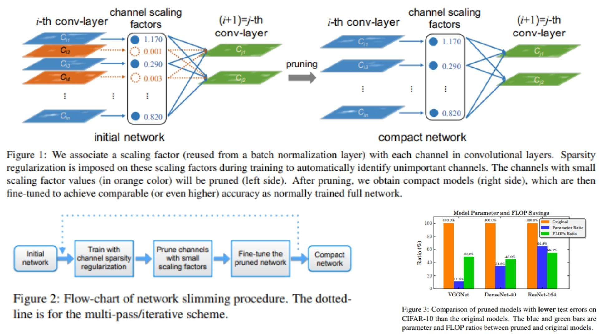

# 🧬 Network Slimming Replication – Channel-Level Model Compression

This repository provides a **PyTorch-based replication** of  
**Learning Efficient Convolutional Networks through Network Slimming**.

The focus is **translating the theoretical idea of channel slimming into a clean, practical implementation**,  
rather than achieving state-of-the-art accuracy or running full-scale training.

- Channel importance encoded by **BatchNorm scaling factors (γ)** 🜁  
- Structured compression via **L1 regularization** on normalization layers 🜂  
- Simple and interpretable **channel pruning pipeline** 🜃  

**Paper reference:** [Network Slimming – Liu et al., 2017](https://arxiv.org/abs/1708.06519) 🜄

---

## 🌌 Overview – Network Slimming Pipeline



The core idea:

> Learn channel importance during training → remove unimportant channels → fine-tune a compact network.

High-level procedure:

1. Start from an **over-parameterized CNN** with Batch Normalization layers.

2. Train the network using standard classification loss augmented with channel sparsity regularization.

3. Channels associated with small BatchNorm scaling factors are considered unimportant and removed.

4. Fine-tune the pruned model to recover performance.

This process can be applied once or iteratively to obtain progressively slimmer networks.

---

## 🧮 Channel Importance via Batch Normalization

Batch Normalization is defined as:

$$
\hat{z} = \frac{z_{in} - \mu_B}{\sqrt{\sigma_B^2 + \epsilon}}, \quad
z_{out} = \gamma \hat{z} + \beta
$$

Here, $\gamma$ is a **learnable scaling factor** associated with each channel.  
In Network Slimming, these scaling factors act as **implicit channel importance indicators**.

By applying **L1 regularization** to $\gamma$, unimportant channels are encouraged to shrink toward zero,  
making them natural candidates for pruning.

---

## 🧠 What the Model Learns

- **BatchNorm γ parameters** automatically encode channel usefulness  
- Channels with negligible contribution are suppressed during training  
- Pruning becomes a deterministic and structured operation  
- The resulting model is **smaller, faster, and easier to deploy**

---

## 📦 Repository Structure

```bash
NetworkSlimming-Replication/
├── src/
│   ├── layers/
│   │   ├── conv_block.py          # Convolutional building blocks
│   │   ├── activation.py          # ReLU and activation helpers
│   │   ├── normalization.py       # BatchNorm wrappers
│   │   └── pooling.py             # Pooling layers
│   │
│   ├── backbone/
│   │   └── cnn_blocks.py
│   │
│   ├── model/
│   │   └── slimming_cnn.py        # CNN with Network Slimming logic
│   │
│   ├── pruning/
│   │   └── prune_channels.py     # Channel pruning based on γ values
│   │
│   ├── loss/
│   │   └── cross_entropy_l1.py   # Cross-entropy + L1 regularization
│   │
│   └── config.py                 # Hyperparameters and pruning ratios
│
├── images/
│   ├── figmix.jpg                # Network Slimming overview
│   └── math.jpg                  # BatchNorm formulation
│
├── requirements.txt
└── README.md
```
---


## 🔗 Feedback

For questions or feedback, contact: [barkin.adiguzel@gmail.com](mailto:barkin.adiguzel@gmail.com)
